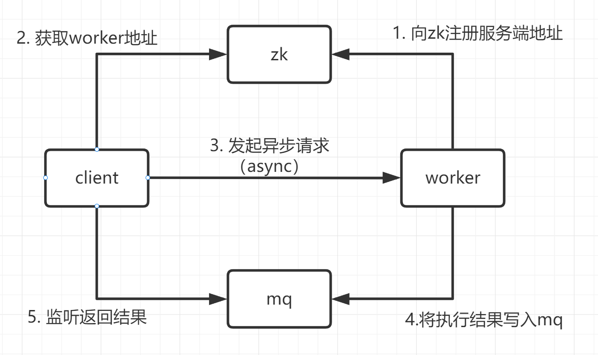
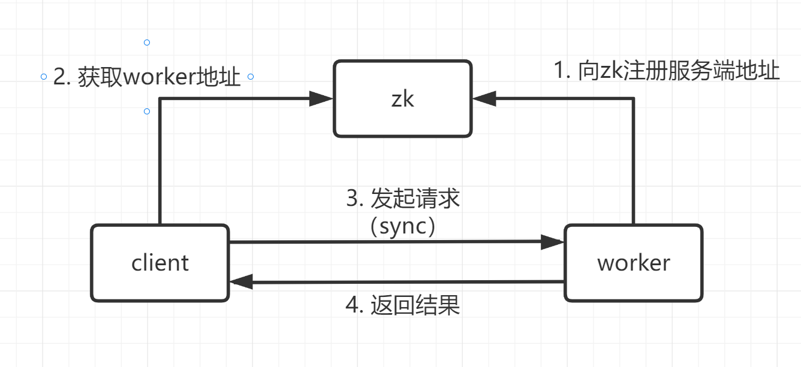

## Worker ##

Worker是一款基于Ansible的分布式任务引擎，将ansible功能的丰富性由API的形式提供调用，例如可以为作业平台提供批量作业等等。

## 架构图

###  异步请求


### 同步请求 


### 环境准备
    Python 3.6
    rabbitmq 3.10.5
    zookeeper 3.8.0


### 更新WORKER配置 ###
    配置文件为：
    /opt/worker/bocloud_worker/bocloud_worker_config.yml
    /opt/worker/bocloud_worker/telegraf_config.yml
    /opt/worker/bocloud_worker/celery_config.py

### 启动脚本 ###
```
# 添加环境
echo "export PYTHONOPTIMIZE=1" >>/etc/profile
source /etc/profile

sh start.sh
```


